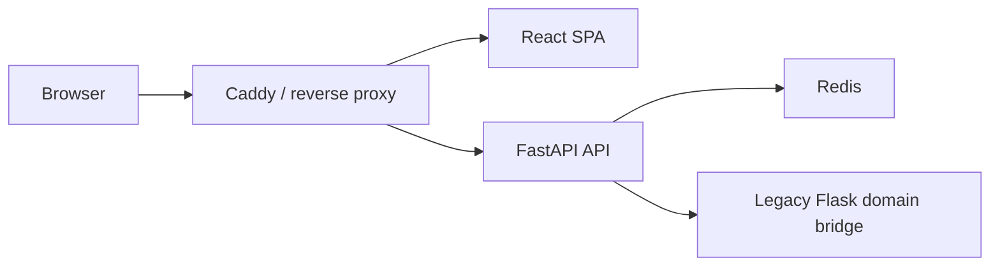
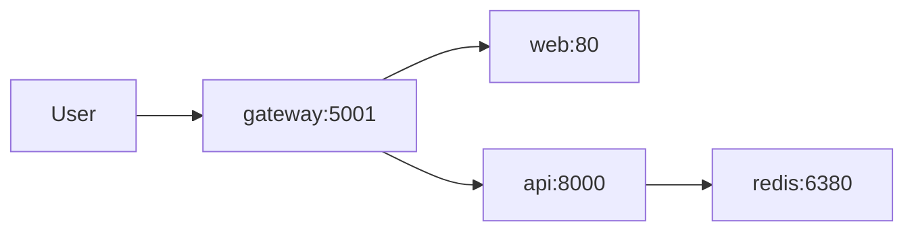

# Переход на FastAPI и React

## Зачем менять текущую схему

Текущее приложение уже выросло из простого Flask-only слоя:

- backend содержит доменную логику, сторы, API и realtime в одном рантайме
- frontend живет в одной HTML-оболочке и больших браузерных скриптах
- деплой сейчас удобен для монолита, но плохо подходит для независимого развития клиента и сервера

Новая схема нужна, чтобы:

- независимо развивать UI и API
- держать стабильный контракт между слоями
- упростить тестирование и версионирование
- подготовить почву под отдельный realtime-контур

## Целевая архитектура

## Что уже заложено в репозитории

### Backend

- `apps/api` поднимает новый `FastAPI`-контур
- внешний API публикуется как `/api/v1/*`
- OpenAPI доступен на `/api/docs`
- слой `LegacyBridge` временно проксирует существующие Flask REST-эндпоинты через внутренний адаптер

Это дает безопасную миграцию:

1. новый frontend уже не зависит от Flask templates
2. backend уже версионируется как отдельный API
3. доменную логику можно выносить из `regatta_app` по частям

### Frontend

- `apps/web` это отдельный `React + TypeScript + Vite` SPA
- все запросы собраны в `src/shared/api/client.ts`
- UI больше не зависит от `window.RegattaApp` и id-driven шаблонов
- структура сразу разложена по слоям `app`, `pages`, `widgets`, `shared`

## Границы ответственности

### FastAPI отвечает за

- внешний HTTP-контракт
- CORS
- typed schema-модели
- API versioning
- будущую точку входа для realtime-миграции

### Legacy Flask временно отвечает за

- существующую доменную логику комнат
- библиотеку карт и гонок
- текущие room/service/store правила
- текущую realtime-логику до отдельного этапа переноса

### React отвечает за

- отображение и состояние интерфейса
- orchestration запросов к `/api/v1`
- независимый SPA lifecycle

## Контракт между frontend и backend

Ключевой принцип здесь такой:

- frontend знает только про `/api/v1`
- backend может менять внутреннюю реализацию, но не ломать внешний контракт

На первом этапе это реализовано через typed schema-модели в `apps/api/app/schemas/`.
Следующий шаг после стабилизации маршрутов:

1. сделать OpenAPI source of truth
2. автогенерировать TypeScript-типы для frontend
3. убрать ручное дублирование контрактов

## Realtime-миграция

REST можно переносить независимо от realtime, поэтому migration path разделен:

1. сначала вынести REST и bootstrap в FastAPI
2. потом вынести доменные сервисы из Flask-зависимых модулей
3. после этого перенести `Socket.IO` или перейти на native WebSocket/SSE слой внутри FastAPI

Это снижает риск, потому что не смешивает:

- транспортную миграцию
- UI-миграцию
- переписывание игровой логики

## Деплой

Для модульной схемы добавлен `docker-compose.modular.yml`.

Топология:

- `web` собирает React SPA
- `api` поднимает FastAPI backend
- `gateway` раздает frontend и проксирует `/api/*` в backend
- `redis` остается общим состоянием для room/session сценариев

## Рекомендуемый порядок миграции

1. Перевести все REST-вызовы нового frontend на `/api/v1`.
2. Перенести bootstrap, room flow и library flow в SPA.
3. Вынести общую доменную логику из `regatta_app` в framework-agnostic сервисы.
4. Убрать proxy-bridge и подключить FastAPI напрямую к сервисному слою.
5. Перенести realtime-канал.
6. После выноса realtime выключить legacy Flask entrypoint из production.

## Практический результат текущего шага

После этих изменений у проекта уже есть:

- отдельный backend-контур на `FastAPI`
- отдельный frontend-контур на `React`
- новая модульная схема деплоя
- безопасный путь поэтапной миграции без попытки переписать весь продукт за один релиз
